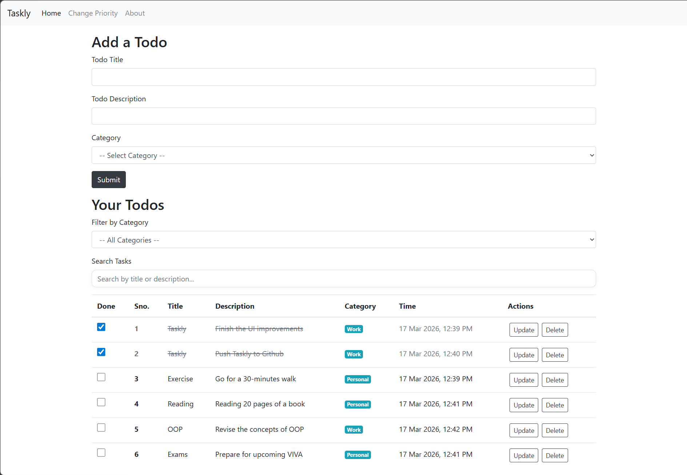
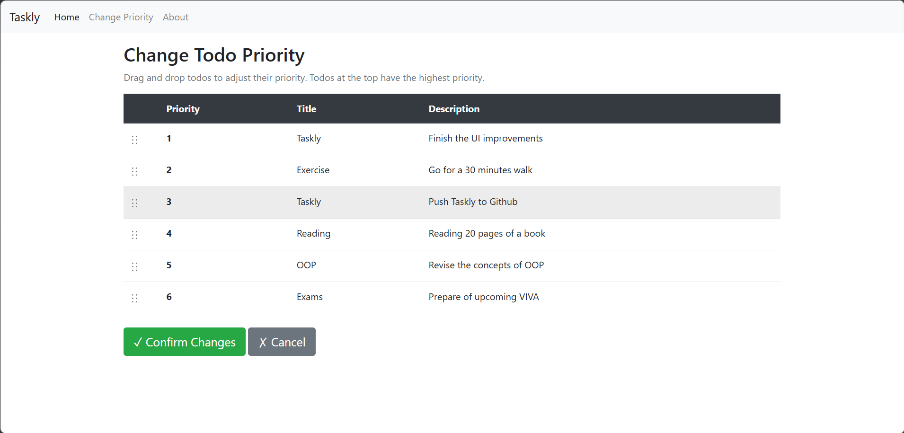
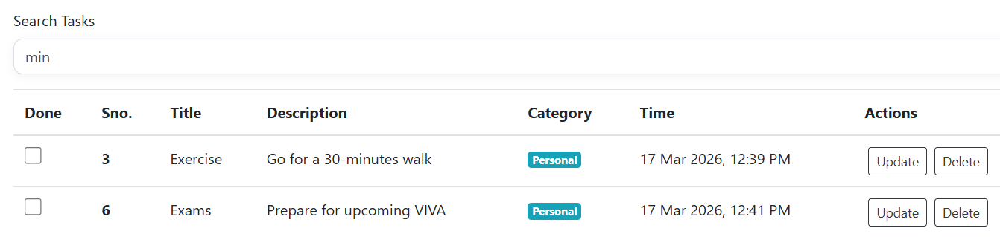

# Taskly

A simple and interactive Todo application built with Flask, SQLAlchemy, and Bootstrap.

## Features

- Add, update, and delete tasks
- Mark tasks complete/incomplete using checkboxes
- Live search filter by title or description
- Category support (Work, Personal)
- Category-based filtering
- Task priority management with a dedicated reorder 


## Tech Stack

- Python
- Flask
- Flask-SQLAlchemy
- SQLite
- Bootstrap 4

## Project Structure

```text
Flask/
|-- app.py
|-- templates/
|-- static/
|-- instance/
|-- env/
```

## Run Locally

1. Create and activate a virtual environment (if needed):

```powershell
python -m venv env
.\env\Scripts\Activate.ps1
```

2. Install dependencies:

```powershell
pip install Flask Flask-SQLAlchemy
```

3. Start the app:

```powershell
python app.py
```

4. Open in browser:

```text
http://127.0.0.1:5000/
```

## Screenshots

### Home Page
<p align="center">
	
</p>

### Change Priority


### Search Feature


## Notes

- The database file is created automatically in the instance folder.
- Default categories are initialized automatically.
- Existing databases are auto-updated to include the task completion field.

## Future Improvements

- Authentication (multi-user todo lists)
- Due dates and reminders
- Pagination and advanced filters
- Docker support

## License

This project is for learning and practice.
